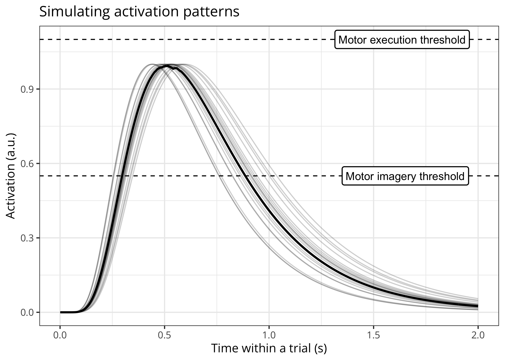
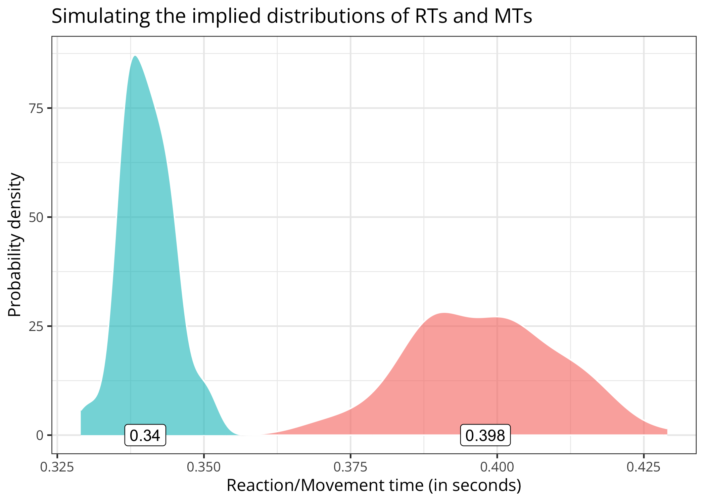

# momimi

<!-- badges: start -->
<!-- badges: end -->

The goal of `momimi` is to provide utilities for fitting two models of
motor inhibition during motor imagery.

## Installation

You can install the development version of `momimi` from GitHub with:

``` r
remotes::install_github(
    repo = "https://github.com/lnalborczyk/momimi",
    dependencies = TRUE
    )
```

## Usage

We start by simulating some data (here, 100 observations or RTs and
MTs).

``` r
library(momimi)

simulated_data <- model(
    nsims = 100, nsamples = 2000,
    exec_threshold = 1, imag_threshold = 0.5,
    amplitude_activ = 1.5, peak_time_activ = log(0.5), curvature_activ = 0.4,
    amplitude_inhib = 1.75, peak_time_inhib = log(0.5), curvature_inhib = 0.5,
    model_version = "TMM",
    full_output = TRUE
    )
```

We can plot the data…

``` r
# plotting only the latent function(s)
plot(x = simulated_data, method = "functions")
#> Warning: Removed 1413 rows containing non-finite values (`stat_summary()`).
```



``` r

# plotting only the distributions of RTs/MTs distributions
plot(x = simulated_data, method = "distributions")
```



We can then fit the threshold modulation model to these data…

``` r
fitting(
    data = simulated_data,
    nsims = 200,
    error_function = "g2",
    method = "DEoptim",
    model_version = "PIM",
    par_names = c("amplitude_ratio", "peak_time", "curvature_activ", "curvature_inhib"),
    lower_bounds = c(1, 0.5, 0.1, 1),
    upper_bounds = c(2, 1.5, 0.6, 2),
    nstudies = 200,
    action_mode = "executed",
    initial_pop_constraints = FALSE,
    maxit = 100
    )
```
