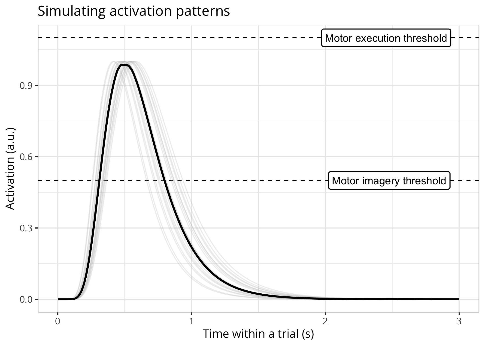
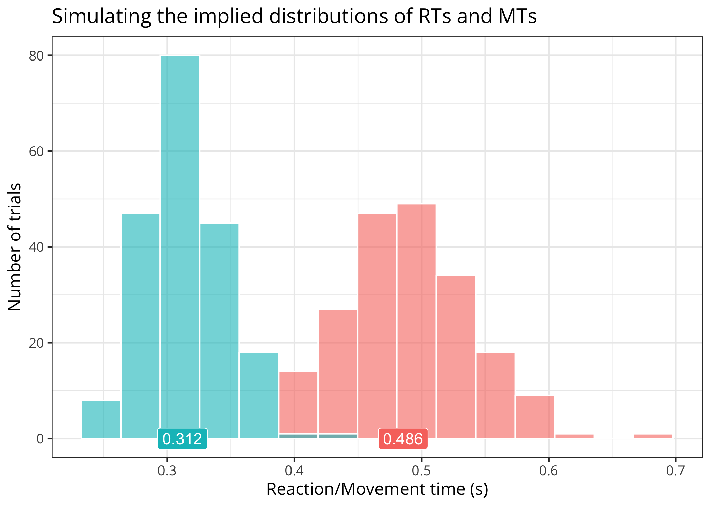
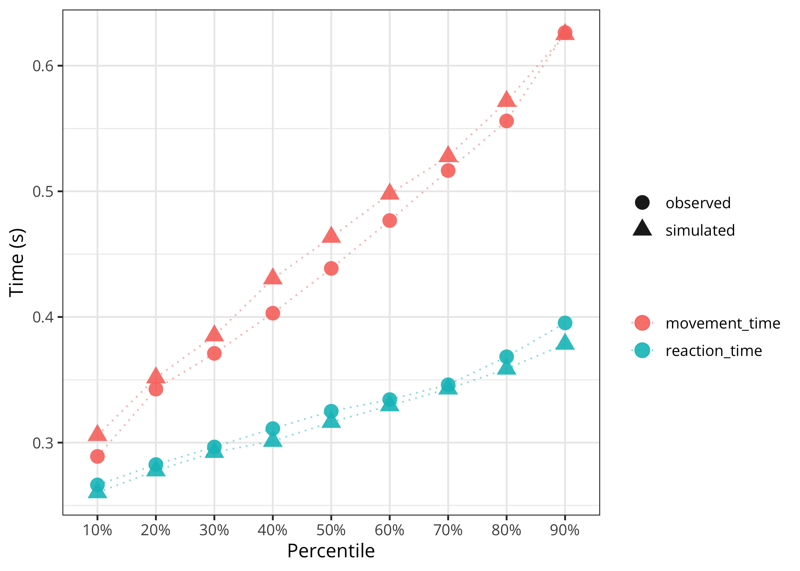

# Models of Motor Inhibition during Motor Imagery

[](https://github.com/lnalborczyk/momimi)
[](https://github.com/lnalborczyk/momimi)

The `momimi` package implements different versions of the “threshold
modulation model” (TMM3/TMM4) of motor imagery and provides fitting and
plotting utilities.

## Installation

You can install the latest stable version of the package from GitHub
with:

``` r
# install.packages("devtools")
devtools::install_github(repo = "lnalborczyk/momimi", build_vignettes = TRUE)
```

## Usage

### Simulating and plotting data

We start by simulating some data (here, 100 observations or RTs and
MTs).

``` r
library(tidyverse)
library(momimi)

simulated_data <- model(
    nsims = 100, nsamples = 2000,
    exec_threshold = 1.1, imag_threshold = 0.55,
    peak_time = log(0.5), curvature = 0.5,
    model_version = "TMM3",
    full_output = TRUE
    )
```

We can plot the underlying activation function and the implied
distributions of RTs and MTs.

``` r
# plotting only the latent function(s)
plot(x = simulated_data, method = "functions")
```



``` r

# plotting only the distributions of RTs/MTs distributions
plot(x = simulated_data, method = "distributions")
```



### Fitting the models

We can also use the model to generate realistic data from known
parameter values and then fit the model (below, the 3-parameter version
of the TMM) to these data to try recovering the original parameter
values.

``` r
# plausible "true" parameter values in the TMM3
# parameters are the motor execution threshold, the peak time, and the curvature
true_pars <- c(1.1, 0.5, 0.4)

# simulating data using these parameter values
simulated_data <- simulating(
    nsims = 200,
    nsamples = 3000,
    true_pars = true_pars,
    action_mode = "imagined",
    model_version = "TMM3"
    )

# displaying the first ten rows of these data
head(x = simulated_data, n = 10)
#>    reaction_time movement_time action_mode
#> 1      0.3463210     0.5775052    imagined
#> 2      0.2916296     0.3477735    imagined
#> 3      0.3313592     0.4388002    imagined
#> 4      0.2302411     0.5789106    imagined
#> 5      0.2832451     0.5234344    imagined
#> 6      0.3649216     0.3350144    imagined
#> 7      0.3472452     0.6709369    imagined
#> 8      0.2788206     0.4660134    imagined
#> 9      0.3314475     0.6250139    imagined
#> 10     0.4021022     0.4734235    imagined
```

We fit the model and use realistic constraints (e.g., the RT/MT should
be no less than 0.1s and no more than 2 seconds) on the initial
parameter values (by setting `initial_pop_constraints = TRUE`) to
facilitate convergence (fitting can take a while).

``` r
# fitting the model
results <- fitting(
    data = simulated_data,
    nsims = 200,
    error_function = "g2",
    method = "DEoptim",
    model_version = "TMM3",
    lower_bounds = c(1.0, 0.3, 0.2),
    upper_bounds = c(1.4, 0.7, 0.6),
    initial_pop_constraints = TRUE,
    nstudies = 200,
    rt_contraints = range(simulated_data$reaction_time),
    mt_contraints = range(simulated_data$movement_time),
    maxit = 100
    )
```

``` r
# fitting summary
summary(results)
#> 
#> ***** summary of DEoptim object ***** 
#> best member   :  1.13808 0.50313 0.41482 
#> best value    :  0.00876 
#> after         :  100 generations 
#> fn evaluated  :  26664 times 
#> *************************************
```

We can then plot the underlying (latent) function(s). Note that this
returns a `ggplot2` object that can be subsequently modified.

``` r
plot(x = results, method = "latent", model_version = "TMM3") +
    labs(title = "Example of latent activation function")
```


We can also do “predictive checks” by comparing the data used to fit the
model to data simulated from the model using the estimated parameter
values.

``` r
plot(
    x = results, original_data = simulated_data,
    method = "ppc", model_version = "TMM3", action_mode = "imagined"
    )
```


We can also do another form of “predictive check” by comparing the
quantile values of the original and simulated data.

``` r
plot(
    x = results, original_data = simulated_data,
    method = "quantiles", model_version = "TMM3", action_mode = "imagined"
    )
```



We can also visualise the trajectory in parameter space during
optimisation interactively using `plotly` (not shown below, but you
should try this).

``` r
plot(x = results, method = "optimisation")
```

## References

Nalborczyk, L., Longcamp, M., Gajdos, T., Servant, M. & Alario, F.‐X.
(in preparation). Modelling the onset and duration of imagined actions:
Assessing a novel algorithmic model of motor imagery.

Nalborczyk, L., Longcamp, M., Gajdos, T., Servant, M., & Alario, F.-X.
(under review). Towards formal models of inhibitory mechanisms involved
in motor imagery: A commentary on Bach, Frank, & Kunde (2022). Preprint
available at <https://psyarxiv.com/tz6x2/>.

## Getting help

If you encounter a bug or have a question please file an issue with a
minimal reproducible example on
[GitHub](https://github.com/lnalborczyk/momimi/issues).
