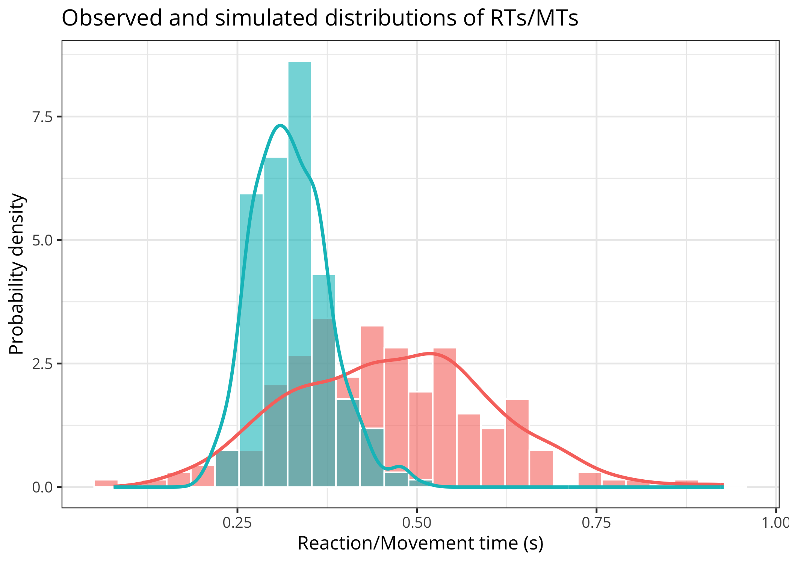

# Models of Motor Inhibition during Motor Imagery

[](https://github.com/lnalborczyk/momimi)
[](https://github.com/lnalborczyk/momimi)
[](https://github.com/lnalborczyk/momimi)

The `momimi` package implements the “threshold modulation model” (TMM)
and the “parallel inhibition model” (PIM) of motor inhibition during
motor imagery and provides fitting and plotting utilities.

## Installation

You can install the development version from GitHub with:

``` r
# install.packages("devtools")
devtools::install_github(repo = "lnalborczyk/momimi", build_vignettes = TRUE)
```

## Usage

### Simulating and plotting data

We start by simulating some data (here, 100 observations or RTs and
MTs).

``` r
library(tidyverse)
library(momimi)

simulated_data <- model(
    nsims = 100, nsamples = 2000,
    exec_threshold = 1, imag_threshold = 0.5,
    amplitude_activ = 0.8, peak_time_activ = log(0.5), curvature_activ = 0.4,
    model_version = "TMM",
    # amplitude_inhib = 0.8, peak_time_inhib = log(0.5), curvature_inhib = 0.6,
    # model_version = "PIM",
    full_output = TRUE
    )
```

We can plot the underlying activation function and the implied
distributions of RTs and MTs.

``` r
# plotting only the latent function(s)
plot(x = simulated_data, method = "functions")
```


``` r

# plotting only the distributions of RTs/MTs distributions
plot(x = simulated_data, method = "distributions")
```


### Fitting the models

We can also use the model to generate realistic data from known
parameter values and then fit the model to these data to try recovering
the original parameter values.

``` r
# plausible "true" parameter values in the TMM
true_pars <- c(1.1, 0.5, 0.3, 1.25)

# simulating data using these parameter values
simulated_data <- simulating(
    nsims = 200,
    nsamples = 2000,
    true_pars = true_pars,
    action_mode = "imagined",
    model_version = "TMM"
    )

# displaying the first ten rows of these data
head(x = simulated_data, n = 10)
#>    reaction_time movement_time action_mode
#> 1      0.3712421     0.2942656    imagined
#> 2      0.3806787     0.2684245    imagined
#> 3      0.3715586     0.3110980    imagined
#> 4      0.3671511     0.3004650    imagined
#> 5      0.3724952     0.2979726    imagined
#> 6      0.3663551     0.3092010    imagined
#> 7      0.3721625     0.3078148    imagined
#> 8      0.3818147     0.2841863    imagined
#> 9      0.3673456     0.2945165    imagined
#> 10     0.3736252     0.2936363    imagined
```

We fit the model and use extra constraints on the initial parameter
values to facilitate convergence (fitting can take a while).

``` r
# fitting the model
results <- fitting(
    data = simulated_data,
    nsims = 200,
    error_function = "g2",
    method = "DEoptim",
    model_version = "TMM",
    lower_bounds = c(0, 0.5, 0, 0),
    upper_bounds = c(2, 1.5, 1, 1),
    initial_pop_constraints = TRUE,
    maxit = 50
    )
```

``` r
# fitting summary
summary(results)
#> 
#> ***** summary of DEoptim object ***** 
#> best member   :  1.72914 0.50004 0.24893 0.99165 
#> best value    :  0.02302 
#> after         :  50 generations 
#> fn evaluated  :  10455 times 
#> *************************************
```

We can then plot the underlying (latent) function(s).

``` r
plot(x = results, method = "latent", model_version = "TMM") +
    labs(title = "Example of latent activation function")
```


We can also do predictive checks by comparing the data used to fit the
model to data simulated from the model using the estimated parameter
values.

``` r
plot(
    x = results, original_data = simulated_data,
    method = "ppc", model_version = "TMM", action_mode = "imagined"
    )
```



## References

Nalborczyk, L., Longcamp, M., Gajdos, T., Servant, M., & Alario, F.-X.
(*to be submitted*). Towards formal models of inhibitory mechanisms
involved in motor imagery: A commentary on Bach, Frank, & Kunde (2022).

## Getting help

If you encounter a bug or have a question please file an issue with a
minimal reproducible example on
[GitHub](https://github.com/lnalborczyk/momimi/issues).
